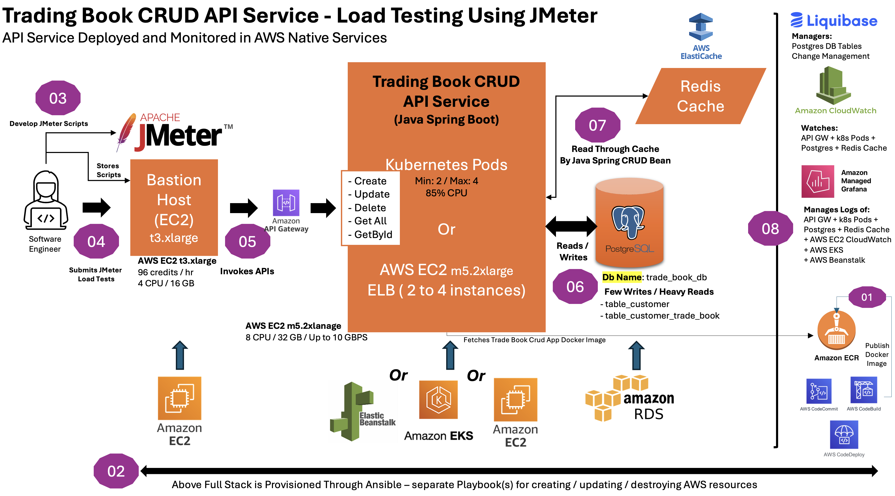

# Trade Book Load Test Master (using AWS Native Services)

## Overview

Welcome to the **Trade Book Load Test Master (using AWS Native Services)** repository. This central hub contains documentation, guidelines, and links to all repositories associated with the load testing of the Trade Book CRUD API services. The project includes multiple components developed in Java and .NET, utilizing various tools and technologies, leveraging AWS native services, to ensure a comprehensive and effective load testing strategy.

## Project Architecture

The architecture for the load testing setup is designed to evaluate the performance and scalability of the Trade Book CRUD API services under different conditions. The architecture leverages several AWS services, Java and .NET technologies, and various monitoring and testing tools. Key components include:

1. **API Services**:
   - Java Spring Boot and .NET Core implementations for CRUD operations.
   - Integration with PostgreSQL databases and Redis caching for optimized performance.

2. **Load Testing**:
   - JMeter scripts to simulate realistic load scenarios for both API implementations.

3. **Infrastructure Automation**:
   - Ansible playbooks for automating the setup and configuration of the testing environment on AWS.

4. **Monitoring and Logging**:
   - Real-time monitoring using AWS CloudWatch, Grafana dashboards, and ELK Stack for comprehensive visibility into performance metrics.

### Updated Architecture Diagram

The updated architecture diagram illustrates the following components:

- **Bastion Host (EC2 t3.xlarge)**: Acts as the entry point for JMeter load tests. It stores and submits JMeter scripts to simulate various load conditions.
- **API Gateway**: Routes incoming requests to the appropriate API services deployed either on Kubernetes Pods or EC2 instances.
- **API Services (Java Spring Boot)**:
  - Deployed on Kubernetes Pods (min: 2, max: 4 pods) with auto-scaling based on CPU usage or on AWS EC2 m5.2xlarge instances with an Elastic Load Balancer (ELB).
  - Supports CRUD operations (`Create`, `Update`, `Delete`, `Get All`, `GetById`).
- **PostgreSQL Database (Amazon RDS)**:
  - Database name: `trade_book_db`.
  - Handles few write operations and heavy read operations, particularly on `table_customer` and `table_customer_trade_book`.
- **Redis Cache (AWS ElastiCache)**:
  - Utilized for caching read operations to improve performance.
- **Monitoring and Logging**:
  - Managed using Amazon CloudWatch and Amazon Managed Grafana for monitoring API Gateway, Kubernetes Pods, PostgreSQL, and Redis Cache.
  - Logs managed for AWS services, including EC2, EKS, and Beanstalk.

## Repository Overview

The project is organized into several repositories, each serving a specific purpose:

### 1. [trade-book-load-test-api-java](https://github.com/javakishore-veleti/trade-book-load-test-api-java)

This repository contains the Java-based API service for the Trade Book CRUD application, built with Spring Boot. It integrates with PostgreSQL using the JPA ORM and utilizes Redis caching via Spring libraries to enhance performance. The service is designed for rigorous load testing to assess performance and scalability.

### 2. [trade-book-load-test-api-dotnet](https://github.com/javakishore-veleti/trade-book-load-test-api-dotnet)

This repository features the .NET Core-based API service for the Trade Book CRUD application. It uses Entity Framework Core for interaction with a PostgreSQL database and integrates Redis caching to improve response times and scalability. The service supports extensive load testing scenarios.

### 3. [trade-book-load-test-jmeter](https://github.com/javakishore-veleti/trade-book-load-test-jmeter)

The JMeter repository includes scripts designed for load testing the Java and .NET API services. These scripts simulate various CRUD operations, such as creating, updating, deleting, and retrieving records, to test the API's performance under different load conditions.

### 4. [trade-book-load-test-ansible](https://github.com/javakishore-veleti/trade-book-load-test-ansible)

This repository contains Ansible playbooks used to automate the provisioning and configuration of the AWS environment for load testing. It covers deploying the API services, setting up PostgreSQL databases and Redis caches, and configuring network and security settings to ensure a consistent and scalable environment.

### 5. [trade-book-load-test-infra](https://github.com/javakishore-veleti/trade-book-load-test-infra)

The Infrastructure repository provides infrastructure-as-code (IaC) configurations using tools like Terraform or AWS CloudFormation. It includes scripts for setting up AWS resources, Kubernetes deployments, and other necessary infrastructure to support load testing activities.

### 6. [trade-book-load-test-monitoring](https://github.com/javakishore-veleti/trade-book-load-test-monitoring)

This repository contains configurations and scripts for monitoring the load testing environment. It includes setups for AWS CloudWatch, Grafana dashboards, and ELK Stack to capture real-time performance metrics, log management, and alerting during load testing.

## How to Use This Project

1. **Clone Repositories**: Start by cloning each repository to your local environment.

2. **Set Up Infrastructure**: Use the `trade-book-load-test-infra` and `trade-book-load-test-ansible` repositories to set up the necessary AWS environment and infrastructure.

3. **Deploy API Services**: Deploy both the Java and .NET API services using the respective repositories (`trade-book-load-test-api-java` and `trade-book-load-test-api-dotnet`).

4. **Run Load Tests**: Utilize the JMeter scripts in the `trade-book-load-test-jmeter` repository to run load tests against the deployed services.

5. **Monitor Performance**: Monitor the performance and logs using configurations from the `trade-book-load-test-monitoring` repository.

